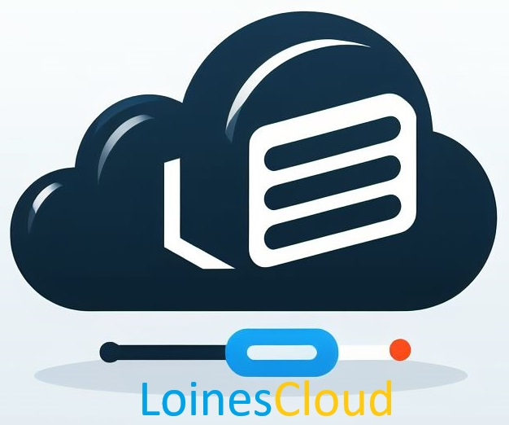

# LoinesCloud Project

## Overview

LoinesCloud is a cloud-based platform that provides a range of services including file storage, applications, and more. This README provides an overview of the project, how to set it up, and how to contribute.

## Features

- **File Storage** Storage your files 100% on the cloud
- **Applications:** Access a variety of applications, including quizzes, CMS, ToDoList, and a calendar.
- **Open Source:** LoinesCloud is 100% open source, allowing users to modify and customize it.

## Getting Started

To get started with LoinesCloud, follow these steps:

1. Clone the repository: `git clone https://github.com/your-username/loinescloud.git`
2. Navigate to the project directory: `cd loinescloud`
3. Set up the required dependencies: `php -S localhost:1234`
4. Now you can access to the cloud by localhost:1234 /!\ One fonction is connected to the local Loines BDD, it will not work

## Usage

go to http://localhost:1234

### Create an account

- Open the login form by clicking the floating button in the bottom-right corner.
- Enter your username and password.
- Click the "Submit" button.

### Navigating Home

- Click on the the cloud, or the app icon, for access to the second panel, you can ALWAYS return to the cloud panel by pressing + and the house

### Adding Your Own Features

LoinesCloud is open source, and you are encouraged to contribute! To add your own features:

1. Fork the repository on GitHub.
2. Create a new branch for your feature: `git checkout -b feature-name`
3. Implement your feature and commit the changes: `git commit -m "Add feature-name"`
4. Push the changes to your fork: `git push origin feature-name`
5. Open a pull request on GitHub.

## Dependencies

- PHP.

## Contributing

If you'd like to contribute to LoinesCloud, please send me an email : contact@loines.ch

## License

This project is licensed under the [MIT License](LICENSE).

## Contact

For inquiries, contact [contact@loines.ch].
